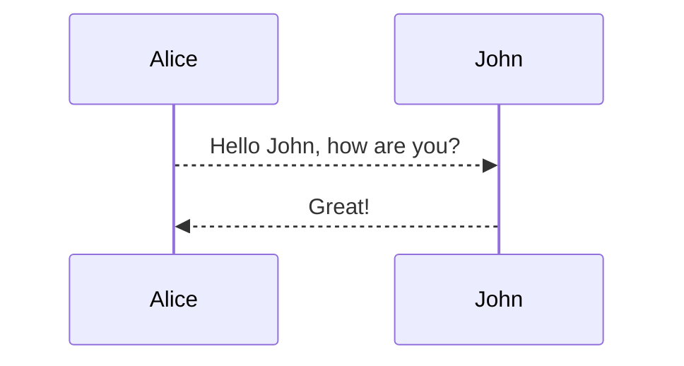

**超链接**

```
[百年孤独](http://blog.imjcker.com)

<https://www.github.com/imjcker>
```

[百年孤独](http://blog.imjcker.com)

<https://github.com/imjcker>

**列表**

```
1. 有序列表项 1

2. 有序列表项 2

3. 有序列表项 3
```

1. 有序列表项 1

2. 有序列表项 2

3. 有序列表项 3

```
* 无序列表项 1

* 无序列表项 2

* 无序列表项 3
```

* 无序列表项 1

* 无序列表项 2

* 无序列表项 3

```
- [x] 任务列表 1
- [ ] 任务列表 2
```

- [x] 任务列表 1
- [ ] 任务列表 2

**强调**

```
~~删除线~~

**加黑**

*斜体*
```

~~删除线~~

**加黑**

*斜体*

**标题**

```
# 一级标题
## 二级标题
### 三级标题
#### 四级标题
##### 五级标题
###### 六级标题
```

Tips: `#` 与标题中间要加空格。

**表格**

```
| HEADER1 | HEADER2 | HEADER3 | HEADER4 |
| ------- | :------ | :-----: | ------: |
| content | content | content | content |
```

| HEADER1 | HEADER2 | HEADER3 | HEADER4 |
| ------- | :------ | :-----: | ------: |
| content | content | content | content |

1. :----- 表示左对齐
2. :----: 表示中对齐
3. -----: 表示右对齐

**代码块**

```python
print 'Hello, World!'
```

**图片**

```

```


**锚点**

```
* [目录](#目录)
```

* [目录](#目录)

**表情**Emoji

🐫
😊
😄

**脚标**Footnotes

This is a text with footnote[^1].

**mermaid**

<div class="mermaid">
sequenceDiagram
    Alice-->>John: Hello John, how are you?
    John-->>Alice: Great!
</div>




**序列图**sequence

```sequence
Andrew->China: Says Hello
Note right of China: China thinks\nabout it
China-->Andrew: How are you?
Andrew->>China: I am good thanks!
China-->Andrew: what is wrong with you?
```

**流程图**flowchart

```flow
st=>start: Start
e=>end
op1=>operation: My Operation
sub1=>subroutine: My Subroutine
cond=>condition: Yes
or No?
io=>inputoutput: catch something...

st->op1->cond
cond(yes)->io->e
cond(no)->sub1(right)->op1
```

**数学公式**mathjax

When $$(a \ne 0)$$, there are two solutions to $$(ax^2 + bx + c = 0)$$ and they are

$$x = {-b \pm \sqrt{b^2-4ac} \over 2a}.$$

water :  H~2~O

[^1]: Here is the footnote 1 definition.